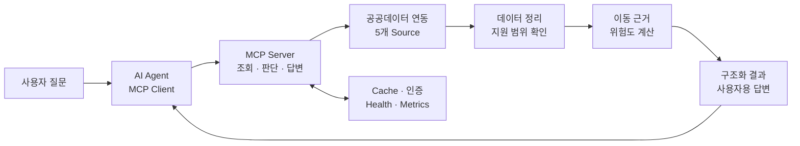

<!--
게시 전 체크리스트

- barrier_free_mobility_mcp 로컬 변경사항을 GitHub main에 반영
- Linux CI에서 release-safety scanner가 .venv symlink를 따라가는 문제 수정
- GitHub Actions의 quality, release safety, Docker build 전체 통과 확인
- 실제 live API smoke 결과와 본문의 지원 범위 재확인
- assets/img/mcp/prev_icon3.png 추가 후 preview_image 설정
- Notion 상세 문서 생성 후 본문의 상세 정리 링크 연결
- 검증 수치와 기준일 갱신
-->

앞에서는 MCP가 어떤 순서로 Tool을 불러오고, 실제 실행은 어디서 일어나는지 코드로 확인해봤다. 마지막에 다음에는 직접 MCP 서버를 만들어보겠다고 했었는데, 이번에 그걸 해봤다.

어떤 주제로 만들지 고민하다가 서울 지하철의 교통약자 이동 정보를 선택했다. 경로, 엘리베이터, 편의시설을 제공하는 공공 API를 MCP Tool로 감싸면 꽤 쓸만한 서비스가 될 것 같았다.

처음에는 여러 API를 연결해서 Agent에게 넘겨주면 알아서 잘 정리해줄 거라고 생각했다. 그런데 실제로 만들어보니 API를 호출하는 것보다, 그 데이터로 어디까지 말할 수 있는지 정하는 일이 훨씬 어려웠다.

엘리베이터가 있다는 것과 휠체어 사용자가 승강장에서 출구까지 이동할 수 있다는 것은 전혀 다른 얘기였다. 데이터가 비어 있다고 시설이 없는 것도 아니었고, 공공 API가 실패했는데 Agent가 그럴듯하게 답을 만들어서는 더더욱 안 됐다.

> 공공데이터 다섯 종류를 MCP에 붙이면 끝날 줄 알았다. 늘 그렇듯 붙이고 나서부터가 시작이었다.

그래서 단순히 공공 API를 대신 호출해주는 서버가 아니라, 여러 출처의 데이터를 하나로 정리하고 확인된 근거 안에서만 답하는 **Barrier-Free Mobility MCP**를 만들었다.

**프로젝트 자료**

- 소스 코드: [GitHub 저장소](https://github.com/kaero313/barrier-free-mobility-mcp)
- 전체 기록 허브: [Barrier-Free Mobility MCP](https://torpid-icon-d8a.notion.site/Barrier-Free-Mobility-MCP-39f4054272b58145b90ed07cd4f38ce0)

 

# 프로젝트를 시작한 이유
---

일반적인 지하철 길찾기는 최단 시간과 환승 횟수를 잘 알려준다. 하지만 휠체어, 유모차, 지팡이 또는 보행기를 사용하는 사람에게 필요한 정보는 조금 다르다.

| 일반 길찾기에서 보는 것 | 이 프로젝트에서 추가로 보는 것 |
| :--- | :--- |
| 가장 빠른 경로인가? | 이동에 필요한 시설을 실제로 확인했는가? |
| 환승이 몇 번인가? | 환승역의 엘리베이터 동선이 이어지는가? |
| 엘리베이터가 있는가? | 현재 운행 중이고 필요한 구간을 연결하는가? |
| 결과가 비어 있는가? | 시설 없음, 조회 실패, 제공 범위 밖 중 무엇인가? |
| 경로를 안내할 수 있는가? | 모르는 정보가 있다면 무엇을 다시 확인해야 하는가? |

문제는 이런 정보가 한곳에 모여 있지 않다는 점이었다. 최단경로, 편의시설 위치, 승강기 가동 상태, 엘리베이터 위치, 장애인화장실 정보를 각각 가져온 뒤 같은 역과 호선 기준으로 다시 맞춰야 했다.

게다가 공공데이터에 엘리베이터가 있다고 적혀 있어도 승강장과 대합실을 연결하는지, 환승 구간에 쓸 수 있는지, 출구까지 이어지는지는 또 따로 확인해야 했다.

결국 일반 길찾기 앱을 새로 만드는 것보다는, 기존 경로 후보에 교통약자 관점의 근거와 주의사항을 붙이는 쪽으로 방향을 정했다.

 

# 최종 목표
---

Barrier-Free Mobility MCP의 목표는 “가장 안전한 경로”를 대신 결정해주는 것이 아니다. 지금 확인할 수 있는 데이터로 이동에 필요한 조건을 점검하고, 확인하지 못한 부분을 사용자에게 숨기지 않는 것이 목표였다.

> 잘 모르겠으면 잘 모르겠다고 답하는 서버를 만들고 싶었다.

그래서 몇 가지 기준을 먼저 잡았다.

- 위험도와 이동 근거는 LLM이 아니라 백엔드에서 같은 규칙으로 계산한다.
- 정상 조회, 일부 실패, 제공 범위 밖을 서로 다른 결과로 보여준다.
- 일부 API가 실패해도 확인할 수 있는 정보와 출처는 남긴다.
- 사용자에게는 내부 점수보다 현재 결론과 출발 전에 할 일을 먼저 알려준다.

반대로 하지 않기로 한 것도 정했다.

- 특정 경로가 안전하다고 보장하지 않는다.
- 공공 API에 없는 경로나 시설 상태를 만들어내지 않는다.
- 현재 Registry만으로 서울 지하철 전체를 지원한다고 표현하지 않는다.
- 아직 필요하지 않은 운영 인프라까지 억지로 기본 구성에 넣지 않는다.

개발도 이 기준에 맞춰 진행했다. 먼저 Mock 데이터로 전체 흐름을 만들고, 실제 공공 API를 붙인 뒤, 실패 처리와 사용자 답변, 운영 기능 순서로 넓혀갔다. 기능을 하나 추가할 때마다 정상 케이스보다 실패했을 때 어떤 결과가 나와야 하는지를 먼저 정했다.

 

# 전체 아키텍처
---

겉으로 보면 MCP Tool이 공공 API를 호출하는 구조지만, 내부에서는 데이터 조회와 이동 판단을 분리했다.

| 영역 | 구성 | 하는 일 |
| :--- | :--- | :--- |
| MCP | FastMCP, Pydantic | Tool 입출력과 Agent가 사용할 기능 정의 |
| Backend | Async Python, HTTP Client | 여러 API 호출과 경로별 정보 조합 |
| Data | 5개 공공데이터 Source, Normalizer | 서로 다른 응답 형식과 상태값 정리 |
| 판단 | Rule Engine, Evidence Model | 이동 조건과 확인된 근거를 기준으로 위험도 계산 |
| Ops | Memory/Redis Cache, 인증, Docker | 외부 API 실패 대응과 운영 상태 확인 |

## 사용한 공공 API

실제로 연동한 것은 서울교통공사가 제공하는 공공 API 4종이다. 프로젝트에서는 교통약자이용정보 API의 엘리베이터와 장애인화장실 데이터를 각각 분리해 모두 5개 Source로 관리했다.

| Source 역할 | 공식 공공데이터 | 프로젝트에서 확인한 정보 |
| :--- | :--- | :--- |
| 경로 후보 | [최단경로이동정보](https://www.data.go.kr/data/15143842/openapi.do) | 이동 시간, 환승, 구간별 경로 |
| 역사 편의시설 | [편의시설위치정보](https://www.data.go.kr/data/15143841/openapi.do) | 엘리베이터·에스컬레이터 위치와 운행 구간 |
| 승강기 상태 | [교통약자 이용시설 승강기 가동현황](https://www.data.go.kr/data/15067770/openapi.do) | 시설별 가동 상태 |
| 엘리베이터 상세 | [교통약자이용정보](https://www.data.go.kr/data/15143843/openapi.do) | 역·호선별 엘리베이터 위치 |
| 장애인화장실 | [교통약자이용정보](https://www.data.go.kr/data/15143843/openapi.do) | 역·호선별 장애인화장실 위치 |

같은 API에서 제공하더라도 응답 형식과 실패 범위가 다른 데이터를 하나로 묶을 이유는 없었다. 각각 별도 Source로 두고, 조합하기 전에 역·호선·시설 기준으로 정리했다.

현재는 데이터 조회, 전체 이동 판단, 사용자 답변 용도로 8개의 Tool을 제공한다. 여기에 Agent가 답변할 때 지켜야 할 정책을 Prompt와 Resource로 따로 전달한다.

여기서 중요한 점은 **서버 내부에서 LLM을 한 번 더 호출하지 않는다는 것**이다. LLM은 사용자의 질문을 보고 적절한 Tool을 선택하고, 결과를 사용자에게 전달한다. 실제 위험도와 이동 근거는 백엔드에서 계산한다.

질문이 모호할 때도 비슷해 보이는 역을 임의로 고르지 않는다. 한 번에 하나의 추가 질문을 반환해서 출발역이나 호선을 다시 확인한다. 공공 API가 알려주지 않은 경로 역시 서버가 새로 만들어내지 않는다.

 

# 구현하면서 가장 많이 고민한 부분
---

## 1. 이동 판단을 LLM에게 맡기지 않기

처음에는 시설 정보와 경로를 LLM에게 넘기고 위험한지 판단해달라고 하면 되지 않을까 생각했다. 자연스러운 설명은 잘 만들겠지만, 같은 데이터에 다른 결론을 내리거나 확인되지 않은 동선을 이어서 설명할 가능성이 있었다.

그래서 엘리베이터 이용 불가, 필요한 동선의 근거 부족, 공공 API 실패 같은 조건은 백엔드에서 판단하도록 했다. 핵심 경로나 엘리베이터 상태를 확인하지 못했다면 다른 정보가 정상이어도 판단 불가로 남긴다.

엘리베이터가 운행 중이라고 바로 이동 가능으로 보지도 않았다. 휠체어 사용자에게 필요한 승강장-대합실, 환승, 출구 동선 중 하나라도 확인되지 않았다면 주의가 필요한 경로로 처리한다.

경로 후보도 시간만 보고 하나를 고르지 않는다. 모든 후보를 같은 기준으로 확인한 뒤 접근성 위험, 환승 횟수, 이동 시간 순서로 비교한다.

> 시설이 있다는 사실보다, 필요한 동선이 끝까지 이어지는지가 더 중요했다.

## 2. 데이터가 없다는 말의 의미 나누기

공공 API를 붙이면서 가장 먼저 걸린 건 빈 응답이었다. 값이 없다고 해서 바로 “해당 시설이 없습니다”라고 답하면 안 됐다.

정상 조회했지만 조건에 맞는 데이터가 없을 수도 있다. 일부 API만 실패했거나, 아예 현재 제공 범위 밖인 역일 수도 있다. 최신 조회에 실패해서 이전 Cache를 사용한 경우도 별도로 알려줘야 했다.

그래서 정상적인 빈 결과, 일부 실패, 전체 실패, 제공 범위 밖, 이전 데이터 사용을 각각 나눴다. 예를 들어 9호선 일부 구간은 역명과 경로는 조회할 수 있지만 연결된 시설 데이터가 없다. 이 경우 “엘리베이터 없음”으로 바꾸지 않고 아직 지원하지 않는 범위라고 답한다.

> 공공데이터에 없다는 것과 현실에 없다는 것은 전혀 다른 말이었다.

이 상태를 나눈 뒤에야 사용자가 어떤 정보를 다시 확인해야 하는지 제대로 알려줄 수 있었다. Agent가 빈 결과를 자기 방식대로 해석하는 것도 막을 수 있었다.

## 3. 서로 다른 엘리베이터 정보를 합치기

엘리베이터 위치와 실시간 가동 상태는 서로 다른 API에서 가져온다. 문제는 양쪽 데이터의 이름과 ID가 항상 깔끔하게 맞지 않는다는 점이었다.

비슷한 이름만 보고 무조건 합치면 다른 시설의 상태를 연결할 수 있다. 그래서 시설 ID가 같거나, 정확한 이름이 하나만 일치하거나, 하나의 원본에 위치와 상태가 같이 들어 있는 경우에만 같은 엘리베이터로 봤다.

조금이라도 애매하면 억지로 합치지 않고 미확인으로 남겼다. 그 결과 “엘리베이터 운행 중”이라는 문장만 보여주는 것이 아니라, 어느 역의 어떤 구간까지 확인했는지를 같이 설명할 수 있게 됐다.

 

# 운영과 안전장치
---

외부 API는 언제든 느려지거나 실패할 수 있다. 특히 한 번의 요청에서 다섯 종류의 데이터를 조합하다 보니 하나의 장애가 전체 결과를 망가뜨리지 않게 만드는 것이 중요했다.

| 상황 | 처리 방식 |
| :--- | :--- |
| Timeout, 호출 제한, 서버 오류 | 정해진 횟수 안에서만 재시도 |
| 인증 오류, 잘못된 요청 | 재시도하지 않고 바로 실패 처리 |
| 일부 API만 실패 | 확인된 정보는 남기고 실패한 출처를 같이 표시 |
| 최신 데이터 조회 실패 | 정해진 시간 안에서만 이전 Cache 사용 |
| Cache 장애 | Cache 없이 요청을 계속 처리하고 Health 상태를 낮춤 |
| 제공 범위 밖 | 장애나 시설 없음으로 바꾸지 않고 지원 범위를 안내 |

HTTP 연결은 요청마다 새로 만들지 않고 애플리케이션이 실행되는 동안 공유한다. 여러 역의 시설을 동시에 조회하되 외부 API를 한꺼번에 과도하게 호출하지 않도록 동시성 제한도 뒀다.

기본 Cache는 Memory로 정했다. 로컬에서 혼자 실행하는 MCP에 처음부터 Redis가 꼭 필요하지는 않았기 때문이다. 여러 인스턴스에서 Cache를 공유해야 할 때만 Redis를 선택할 수 있게 했다.

Mock과 Live 환경도 분리했다. API Key가 없어도 전체 판단 흐름과 테스트를 실행할 수 있고, 실제 공공 API 검증은 별도의 Smoke Test로 확인한다.

## 사용자에게 보여줄 답변도 직접 관리하기

서버가 정확한 JSON을 반환해도 마지막 문제가 하나 남았다. LLM Client가 결과를 다시 요약하면서 미확인 정보나 기준 시각을 빼버릴 수 있었다.

외부 LLM의 최종 답변을 완전히 통제할 수는 없다. 대신 서버가 일반 사용자가 읽을 답변(`user_message`)까지 만들고, Client가 이 내용을 기준으로 사용하게 했다.

예를 들어 엘리베이터 상태는 확인됐지만 출구까지의 동선이 확인되지 않았다면 다음처럼 답한다.

  

> 2026년 7월 15일 실제 공공 API 데이터로 생성한 사용자 답변이다.

위험 점수나 Cache 상태 같은 내부 정보는 빼고, 현재 결론과 사용자가 해야 할 일을 먼저 보여준다. FastMCP Client와 MCP Python SDK에서도 같은 질문에 기능 탐색과 구조화된 판단 결과가 동일한지 비교했다.

## 로컬에서 돌아가는 것과 실제 운영은 다르다

MCP Endpoint를 외부에 열려면 공공 API Key와 별개의 인증이 필요하다. 그래서 로컬, 제한 테스트, Hosted 환경의 인증 방식을 나누고 입력 크기 제한, 요청 제한, Secret Redaction을 추가했다.

Health와 Metrics에서는 Tool과 외부 API 호출 수, 오류, 평균 지연, Cache와 Fallback 상태를 확인할 수 있다. Container는 권한을 제한한 사용자로 실행하고 HTTPS Reverse Proxy와 선택형 Redis 구성도 준비했다.

다만 OIDC 검증 코드를 만들었다고 실제 인증 제공자와 연동이 끝난 것은 아니다. Metrics와 요청 제한도 현재는 Process 내부에만 있기 때문에 여러 서버가 같이 사용하는 운영 환경에서는 추가 작업이 필요하다.

> 운영을 고려해서 만든 것과 실제 운영으로 검증한 것은 다르다.

현재는 공개 운영 Endpoint와 SLO, Alert, Trace까지 구성한 상태는 아니다. 이 부분은 기능이 있다고 과장하기보다 아직 하지 않은 일로 남기는 것이 맞다고 생각한다.

 

# 테스트와 현재 한계
---

2026년 7월 15일 로컬 기준으로 총 447개 테스트와 Ruff 검사를 통과했다.

테스트 개수 자체보다 다음 내용을 계속 확인할 수 있게 만드는 데 집중했다.

- 역명, 호선, 시설 상태처럼 API마다 다른 데이터를 같은 형태로 바꾸는지
- 일부 API 실패, 오래된 Cache, 지원 범위 밖을 서로 다르게 처리하는지
- 인증과 입력 제한, Secret 노출, MCP 응답 형태에 문제가 없는지
- 사용자 답변에서 주의사항이 빠지거나 안전을 보장하는 표현이 들어가지 않는지

성능도 감으로 판단하지 않고 같은 조건으로 비교했다. 실제 공공 API에 휠체어, 유모차, 화장실 조건 3개를 연속 실행했을 때 Cold Cache는 9,153ms가 걸렸고 외부 API를 8번 호출했다. 같은 입력을 Warm Cache에서 다시 실행하자 4,569ms가 걸렸고 외부 호출은 발생하지 않았다.

  

> 2026년 7월 15일 실제 공공 API를 대상으로 같은 3개 시나리오를 실행한 결과다.

한 번의 로컬 실행 결과라서 평균 응답 시간이나 운영 SLO처럼 쓰지는 않았다. 대신 Cache가 외부 I/O를 얼마나 줄이는지 확인하는 재현 가능한 비교 기준으로 남겼다.

자동 테스트만으로 답변이 읽기 좋은지도 알 수 없었다. 초기 완료 Review에서 행동 가능성 점수는 2/5였다. 낮은 점수를 숨기지 않고 같은 질문으로 7차 검토 자료까지 다시 만들었다. 그 과정에서 사용자 조건별 결론을 나누고, 마지막에 확인해야 할 행동을 더 구체적으로 바꿨다.

다만 Review 자료를 반복해서 만들었다고 실제 사용자 검증까지 끝난 것은 아니다. 이건 교통약자 당사자와 접근성 전문가의 의견을 받아 추가로 확인해야 한다.

현재 Registry에는 65개 역·호선 조합이 들어 있다. 그중 경로 코드와 핵심 시설 데이터까지 확인한 완전 지원 범위는 28개이고, 나머지 37개는 일부 정보가 아직 미검증인 부분 지원 범위다.

- Registry 밖의 역은 비슷한 역으로 확정하지 않고 다시 질문한다.
- 자연어 처리는 범용 NLP가 아니라 현재 지원 범위를 지키기 위한 규칙 기반 방식이다.
- 실제 공공 API의 모든 데이터와 현장 상태를 검증한 것은 아니다.
- 다중 서버의 Metrics와 요청 제한, 실제 사용자 검증은 아직 남아 있다.

결국 이 서버는 특정 경로가 안전하다고 보장하는 서비스가 아니다. 현재 데이터에서 확인한 사실과 모르는 부분을 나누고, 출발 전에 무엇을 다시 확인해야 하는지 알려주는 도구다.

<!--
Notion 생성 후 주요 섹션에 상세 정리 링크 추가

- 프로젝트 목표와 Architecture Decision
- 공공 API Source와 Normalization Mapping
- Risk Rule과 Evidence Model
- 운영·보안·배포 Runbook
- Test Matrix와 사용성 Review
-->

 

# 마무리
---

MCP 서버를 직접 만들어보니 Tool을 등록하고 API를 연결하는 것 자체는 생각보다 어렵지 않았다. 오히려 외부 데이터가 실패했을 때 어떤 답을 내보내야 하는지, Agent가 어디까지 말하게 할지를 정하는 데 시간이 더 많이 들었다.

처음에는 교통 관련 공공 API를 묶어주는 작은 MCP를 생각했다. 지금은 다섯 종류의 데이터를 정리하고, 이동 조건에 따라 근거를 확인하고, 일부 데이터가 실패해도 가능한 답을 남기는 서버가 됐다.

이번 프로젝트를 하면서 느낀 건 MCP도 결국 백엔드 서비스라는 점이다. Tool 이름과 Schema도 중요하지만, 실제로는 데이터의 품질, 실패 처리, Cache, 인증, 테스트 같은 익숙한 문제를 제대로 풀어야 쓸만한 Tool이 된다.

아직 실제 사용자 Review와 더 넓은 Live 데이터 검증, 운영 환경의 지표와 알림은 남아 있다. 다음에는 기능을 더 늘리기보다 실제 Feedback을 받아 지금 만든 판단 기준이 정말 도움이 되는지부터 확인해볼 생각이다.

> 확인하지 못한 것을 확인했다고 말하지 않는 것. 이번 프로젝트에서 가장 중요하게 본 기준이다.
