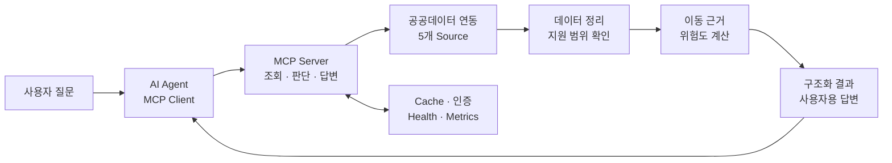

---
# the default layout is 'page'
title: Barrier-Free MCP
icon: fas fa-train-subway
order: 2
image: /assets/img/og/barrier-free-mcp.jpg
mermaid: true
---

MCP가 어떤 순서로 도구를 불러오고 실제 실행은 어디서 일어나는지 [코드로 확인해본 뒤](/posts/mcp_2/), 직접 서버를 하나 만들어보기로 했다.
  
주제를 뭘로 할지 꽤 고민했다. 또 계산기 같은 예제용 도구를 만들기는 싫었고, 실제로 누군가에게 쓸모가 있으면서 백엔드 설계 거리가 나오는 주제를 찾고 싶었다. 공공데이터포털을 뒤지다 보니 서울 지하철의 교통약자 이동 정보가 눈에 들어왔다. 경로, 엘리베이터, 편의시설을 제공하는 공공 API가 이미 있으니, 이걸 MCP 도구로 감싸면 꽤 쓸만한 서비스가 될 것 같았다.
  
처음 생각은 단순했다. API 몇 개 연결해서 Agent에게 넘겨주면 알아서 잘 정리해주겠지. 그런데 실제로 만들어보니 API를 호출하는 것보다, 그 데이터로 어디까지 말해도 되는지 정하는 일이 훨씬 어려웠다. 엘리베이터가 '있다'는 것과 휠체어로 승강장에서 출구까지 '갈 수 있다'는 건 전혀 다른 얘기였고, 데이터가 비어 있다고 시설이 없는 것도 아니었다. 공공 API가 실패했는데 Agent가 그럴듯하게 답을 지어내는 건 더더욱 안 될 일이었다.

> 공공데이터 다섯 종류를 MCP에 붙이면 끝날 줄 알았다. 늘 그렇듯 붙이고 나서부터가 시작이었다.

그래서 방향을 바꿨다. 단순히 공공 API를 대신 호출해주는 서버가 아니라, 여러 출처의 데이터를 하나로 정리하고 확인된 근거 안에서만 답하는 **Barrier-Free Mobility MCP**를 만들었다.

- 소스 코드: [GitHub 저장소](https://github.com/kaero313/barrier-free-mobility-mcp)
- 전체 기록 허브: [Barrier-Free Mobility MCP](https://torpid-icon-d8a.notion.site/Barrier-Free-Mobility-MCP-39f4054272b58145b90ed07cd4f38ce0)

 

# 프로젝트를 시작한 이유
---

일반적인 지하철 길찾기 앱은 최단 시간과 환승 횟수를 잘 알려준다. 그런데 휠체어나 유모차, 지팡이를 쓰는 사람에게 필요한 정보는 조금 다르다. 가장 빠른 경로인지보다 이동에 필요한 시설이 실제로 확인됐는지, 환승역에서 엘리베이터 동선이 이어지는지, 그 엘리베이터가 지금 운행 중인지가 더 중요하다.
  
문제는 이런 정보가 한곳에 모여 있지 않다는 점이었다. 최단경로, 편의시설 위치, 승강기 가동 상태, 엘리베이터 위치, 장애인화장실 정보를 각각 가져온 뒤 같은 역과 호선 기준으로 다시 맞춰야 했다.
  
결국 길찾기 앱을 새로 만드는 것보다는, 기존 경로 후보에 교통약자 관점의 근거와 주의사항을 붙이는 쪽으로 방향을 정했다.

 

# 최종 목표
---

목표는 "가장 안전한 경로"를 대신 결정해주는 서비스가 아니었다. 지금 확인할 수 있는 데이터로 이동에 필요한 조건을 점검하고, 확인하지 못한 부분은 사용자에게 숨기지 않는 것. 이게 전부다.

> 잘 모르겠으면 잘 모르겠다고 답하는 서버를 만들고 싶었다.

그래서 몇 가지 기준을 먼저 잡았다.

- 위험도와 이동 근거는 LLM이 아니라 백엔드에서 같은 규칙으로 계산한다
- 정상 조회 / 일부 실패 / 제공 범위 밖은 서로 다른 결과로 보여준다
- 일부 API가 실패해도 확인된 정보와 출처는 남긴다
- 사용자에게는 내부 점수보다 지금의 결론과 출발 전에 할 일을 먼저 보여준다

반대로 하지 않기로 한 것도 있다. 특정 경로가 안전하다고 보장하는 것, 공공 API에 없는 경로나 시설 상태를 만들어내는 것, 지금 수준으로 서울 지하철 전체를 지원한다고 말하는 것. 셋 다 안 하기로 했다. 아직 필요하지도 않은 운영 인프라를 기본 구성에 욱여넣는 것도 참았다.
  
개발 순서도 이 기준에 맞췄다. 먼저 Mock 데이터로 전체 흐름을 만들고, 실제 공공 API를 붙이고, 실패 처리와 사용자 답변, 운영 기능 순서로 넓혀갔다. 기능을 하나 붙일 때마다 정상 케이스보다 실패했을 때 어떤 결과가 나와야 하는지를 먼저 정했다.

> 목표와 지원 범위는 [프로젝트 목표와 운영 기준](https://torpid-icon-d8a.notion.site/39f4054272b58198b8c4f42119dfba4c)에, 개발 단계별 검증 기준은 [개발과 검증 타임라인](https://torpid-icon-d8a.notion.site/39f4054272b581759251ea2a3eee5aa9)에 정리해뒀다.

 

# 전체 아키텍처
---

겉으로 보면 MCP 도구가 공공 API를 호출하는 단순한 구조지만, 내부에서는 데이터 조회와 이동 판단을 분리했다.

| 영역 | 구성 | 하는 일 |
| :--- | :--- | :--- |
| MCP | FastMCP, Pydantic | 도구 입출력과 Agent가 사용할 기능 정의 |
| Backend | Async Python, HTTP Client | 여러 API 호출과 경로별 정보 조합 |
| Data | 공공데이터 소스 5개, Normalizer | 서로 다른 응답 형식과 상태값 정리 |
| 판단 | Rule Engine, Evidence Model | 이동 조건과 확인된 근거를 기준으로 위험도 계산 |
| Ops | Memory/Redis 캐시, 인증, Docker | 외부 API 실패 대응과 운영 상태 확인 |

## 사용한 공공 API

실제로 연동한 것은 서울교통공사가 제공하는 공공 API 4종이다. 이 중 교통약자이용정보 API는 엘리베이터와 장애인화장실 데이터를 각각 분리해서, 프로젝트에서는 총 5개 소스로 관리했다.

| 역할 | 공식 공공데이터 | 프로젝트에서 확인한 정보 |
| :--- | :--- | :--- |
| 경로 후보 | [최단경로이동정보](https://www.data.go.kr/data/15143842/openapi.do) | 이동 시간, 환승, 구간별 경로 |
| 역사 편의시설 | [편의시설위치정보](https://www.data.go.kr/data/15143841/openapi.do) | 엘리베이터·에스컬레이터 위치와 운행 구간 |
| 승강기 상태 | [교통약자 이용시설 승강기 가동현황](https://www.data.go.kr/data/15067770/openapi.do) | 시설별 가동 상태 |
| 엘리베이터 상세 | [교통약자이용정보](https://www.data.go.kr/data/15143843/openapi.do) | 역·호선별 엘리베이터 위치 |
| 장애인화장실 | [교통약자이용정보](https://www.data.go.kr/data/15143843/openapi.do) | 역·호선별 장애인화장실 위치 |

같은 API에서 주는 데이터라도 응답 형식과 실패 범위가 다르면 하나로 묶을 이유가 없었다. 각각 별도 소스로 두고, 조합하기 전에 역·호선·시설 기준으로 정리했다.
  
현재 도구는 8개다. 데이터 조회용, 전체 이동 판단용, 사용자 답변용으로 나뉘고, Agent가 답변할 때 지켜야 할 정책은 Prompt와 Resource로 따로 전달한다.
  
여기서 하나 중요한 게 있는데, 이 서버는 내부에서 LLM을 한 번 더 호출하지 않는다. LLM이 하는 일은 사용자의 질문을 보고 적절한 도구를 고르고, 결과를 전달하는 것까지다. 실제 위험도와 이동 근거 계산은 전부 백엔드 몫이다. 앞서 코드로 확인했던 "LLM은 도구를 쓰겠다만 결정한다"는 구조를 이번엔 서버 입장에서 그대로 지킨 셈이다.

> 계층별 책임과 기술 선택은 [전체 아키텍처와 책임 경계](https://torpid-icon-d8a.notion.site/39f4054272b581d98870fecdef79ee86)에, 소스별 정규화 기준은 [공공 API와 데이터 정규화](https://torpid-icon-d8a.notion.site/39f4054272b5812186fcfb8d1c545436)에 있다.

 

# 구현하면서 가장 많이 고민한 부분
---

## 1. 이동 판단을 LLM에게 맡기지 않기

처음에는 시설 정보와 경로를 LLM에게 넘기고 "위험한지 판단해줘"라고 하면 되지 않을까 생각했다. 자연스러운 설명이야 잘 만들겠지만, 같은 데이터를 주고도 매번 다른 결론을 내리거나 확인 안 된 동선을 이어붙여 설명할 가능성이 있었다.
  
그래서 엘리베이터 이용 불가, 필요한 동선의 근거 부족, 공공 API 실패 같은 조건 판단은 전부 백엔드 규칙으로 내렸다. 핵심 경로나 엘리베이터 상태를 확인하지 못했으면 다른 정보가 아무리 정상이어도 판단 불가로 남긴다.
  
엘리베이터가 운행 중이라고 바로 이동 가능으로 보지도 않았다. 휠체어 사용자에게 필요한 동선은 승강장-대합실, 환승, 출구까지인데, 이 중 하나라도 확인이 안 되면 주의가 필요한 경로로 처리한다.
  
경로 후보도 시간만 보고 하나를 고르지 않고, 모든 후보를 같은 기준으로 확인한 뒤 접근성 위험, 환승 횟수, 이동 시간 순서로 비교한다.

## 2. '데이터가 없다'는 말의 의미 나누기

공공 API를 붙이면서 가장 먼저 걸린 게 빈 응답이었다. 값이 없다고 바로 "해당 시설이 없습니다"라고 답하면 안 됐다. 정상 조회했는데 조건에 맞는 데이터가 없는 걸 수도 있고, 일부 API만 실패했거나, 아예 제공 범위 밖인 역일 수도 있다. 최신 조회에 실패해서 이전 캐시를 쓴 경우라면 그것대로 알려줘야 했다.
  
그래서 정상적인 빈 결과 / 일부 실패 / 전체 실패 / 제공 범위 밖 / 이전 데이터 사용, 이렇게 상태를 나눴다. 예를 들어 9호선 일부 구간은 역명과 경로는 조회되는데 연결된 시설 데이터가 없다. 이걸 "엘리베이터 없음"으로 바꿔 말하면 안 되고, 아직 지원하지 않는 범위라고 답해야 한다. 공공데이터에 없다는 것과 현실에 없다는 것은 전혀 다른 말이니까.
  
상태를 이렇게 나누고 나서야 사용자에게 뭘 다시 확인해야 하는지 제대로 알려줄 수 있었고, Agent가 빈 결과를 자기 방식대로 해석하는 것도 막을 수 있었다.

## 3. 서로 다른 엘리베이터 정보 합치기

엘리베이터 위치와 실시간 가동 상태는 서로 다른 API에서 온다. 문제는 양쪽의 이름과 ID가 항상 깔끔하게 맞지는 않는다는 점이다. 비슷한 이름만 보고 무조건 합치면 엉뚱한 시설의 상태를 연결해버릴 수 있다.
  
그래서 매칭 조건을 보수적으로 잡았다. 시설 ID가 같거나, 정확히 일치하는 이름이 하나뿐이거나, 하나의 원본에 위치와 상태가 같이 들어 있는 경우에만 같은 엘리베이터로 본다. 조금이라도 애매하면 억지로 합치지 않고 미확인으로 남겼다. 덕분에 "엘리베이터 운행 중"이라는 문장만 던지는 게 아니라, 어느 역의 어떤 구간까지 확인했는지를 같이 설명할 수 있게 됐다.

> 이동 근거 판단과 Agent 답변 계약은 [Evidence 기반 판단과 MCP 계약](https://torpid-icon-d8a.notion.site/39f4054272b5815e9cadc4bccb821ba0)에 정리해뒀다.

 

# 운영과 안전장치
---

외부 API는 언제든 느려지거나 죽을 수 있다. 특히 요청 한 번에 다섯 종류의 데이터를 조합하다 보니, 장애 하나가 전체 결과를 망가뜨리지 않게 만드는 게 중요했다. 상황별 처리는 이렇게 정했다.

- 타임아웃과 서버 오류만 정해진 횟수 안에서 재시도하고, 인증 오류는 바로 실패 처리한다
- 일부 API만 실패하면 확인된 정보는 남기고 실패한 출처를 같이 표시한다
- 최신 조회에 실패하면 정해진 시간 안에서만 이전 캐시를 쓰고, 캐시가 죽으면 캐시 없이 처리한다
- 제공 범위 밖이면 장애나 시설 없음으로 바꾸지 않고 지원 범위를 안내한다

HTTP 연결은 요청마다 새로 만들지 않고 애플리케이션이 떠 있는 동안 공유한다. 여러 역의 시설을 동시에 조회하되, 외부 API를 한꺼번에 두들기지 않도록 동시성 제한도 걸었다.
  
기본 캐시는 메모리로 정했다. 로컬에서 혼자 돌리는 MCP에 처음부터 Redis까지 붙일 필요는 없었기 때문이다. 여러 인스턴스가 캐시를 공유해야 할 때만 Redis를 선택하면 된다.
  
Mock과 Live 환경도 분리했다. API 키가 없어도 전체 판단 흐름과 테스트가 돌아가고, 실제 공공 API 검증은 별도의 smoke test로 확인한다.

## 사용자에게 보여줄 답변도 직접 관리하기

서버가 정확한 JSON을 반환해도 마지막 문제가 하나 남는다. LLM 클라이언트가 결과를 다시 요약하면서 미확인 정보나 기준 시각을 빼먹을 수 있다는 점이다.
  
외부 LLM의 최종 답변을 완전히 통제할 수는 없으니, 대신 서버가 일반 사용자용 답변(`user_message`)까지 직접 만들어서 클라이언트가 이걸 기준으로 쓰게 했다. 예를 들어 엘리베이터 상태는 확인됐는데 출구까지의 동선이 확인 안 됐다면 이렇게 답한다.

  

> 2026년 7월 15일, 실제 공공 API 데이터로 뽑은 사용자 답변이다.

위험 점수나 캐시 상태 같은 내부 정보는 빼고, 현재 결론과 사용자가 해야 할 일을 먼저 보여준다.

## 로컬에서 돌아가는 것과 실제 운영은 다르다

MCP 엔드포인트를 외부에 열려면 공공 API 키와는 별개의 인증이 필요하다. 그래서 로컬, 제한 테스트, Hosted 환경의 인증을 나누고 요청 제한과 시크릿 마스킹을 추가했다. 헬스체크와 메트릭에서는 외부 API 호출과 캐시 상태를 볼 수 있다.
  
다만 여기서 스스로 선을 그은 부분이 있다. OIDC 검증 코드를 짰다고 실제 인증 제공자와 연동이 끝난 건 아니고, 메트릭과 요청 제한도 아직 프로세스 안에만 있어서 서버 여러 대가 같이 쓰는 환경에서는 추가 작업이 필요하다. 공개 운영 엔드포인트와 SLO, Alert, Trace도 아직 없다. 운영을 고려해서 만든 것과 실제 운영으로 검증한 것은 다르니, 이 부분은 기능이 있다고 과장하기보다 아직 안 한 일로 남겨두는 게 맞다고 생각했다.

> 장애 대응, 인증, 관측성과 배포 경계는 [운영·보안·배포 설계](https://torpid-icon-d8a.notion.site/39f4054272b581f7af7cca7494b1fcc7)에 있다.

 

# 테스트와 현재 한계
---

2026년 7월 15일 로컬 기준으로 총 447개 테스트와 Ruff 검사를 통과했다. 개수 자체보다는 데이터 정규화, 실패 상태 구분, 인증과 시크릿, 답변에 안전을 보장하는 표현이 들어가지 않는지를 계속 확인할 수 있게 만드는 데 집중했다.
  
성능도 감으로 판단하지 않고 같은 조건으로 비교해봤다. 실제 공공 API에 휠체어, 유모차, 화장실 조건 3개를 연속 실행했더니 캐시가 빈 상태(Cold)에서는 9,153ms에 외부 API 8회 호출, 같은 입력을 캐시 적중(Warm) 상태에서 다시 돌리자 4,569ms에 외부 호출 0회였다.

  

> 2026년 7월 15일, 같은 3개 시나리오를 실제 공공 API 대상으로 돌린 결과다.

한 번의 로컬 실행이라 평균 응답 시간이나 운영 SLO처럼 쓸 수는 없고, 캐시가 외부 I/O를 얼마나 줄이는지 보는 재현 가능한 비교 기준 정도로 남겨뒀다.
  
자동 테스트만으로는 답변이 읽기 좋은지 알 수 없다는 것도 이번에 배웠다. 초기 완료 리뷰에서 행동 가능성 점수가 5점 만점에 2점이 나왔다. 솔직히 뜨끔했지만 점수를 숨기는 대신 같은 질문으로 7차 검토 자료까지 다시 만들었고, 그 과정에서 사용자 조건별 결론을 나누고 마지막에 확인해야 할 행동을 더 구체적으로 바꿨다.
  
현재 지원 역 목록(registry)에는 65개 역·호선 조합이 들어 있다. 그중 경로 코드와 핵심 시설 데이터까지 확인한 완전 지원은 28개, 나머지 37개는 일부 정보가 미검증인 부분 지원이다. registry 밖의 역은 비슷한 역으로 확정하지 않고 다시 질문하고, 자연어 처리도 범용 NLP 없이 지원 범위를 지키는 규칙 기반으로만 뒀다. 실제 공공 API의 모든 데이터와 현장 상태를 검증한 것도 아니다.
  
결국 이 서버는 특정 경로가 안전하다고 보장해주는 서비스가 아니라, 확인한 사실과 모르는 부분을 나눠서 출발 전에 뭘 다시 확인해야 하는지 알려주는 도구다.

> 자동·Live·사용성 검증 근거는 [테스트·성능·사용성 검증](https://torpid-icon-d8a.notion.site/39f4054272b581748a2ad7dcedccea9a)에, 실제 재현 문제와 운영 시나리오는 [트러블슈팅과 운영 시나리오](https://torpid-icon-d8a.notion.site/39f4054272b58134af14fb79ab31ba74)에 정리해뒀다.

 

# 마무리
---

직접 만들어보니 도구를 등록하고 API를 연결하는 것 자체는 생각보다 어렵지 않았다. 시간을 잡아먹은 건 외부 데이터가 실패했을 때 어떤 답을 내보낼지, Agent가 어디까지 말하게 할지를 정하는 쪽이었다.
  
이번에 제일 크게 느낀 건 MCP도 결국 백엔드 서비스라는 점이다. 도구 이름과 schema 설계도 중요하지만, 실제로는 데이터 품질, 실패 처리, 캐시, 인증, 테스트 같은 익숙한 문제들을 제대로 풀어야 쓸만한 도구가 된다.

## 다음 목표

아직 실제 사용자 리뷰와 더 넓은 Live 데이터 검증, 운영 환경의 지표와 알림이 남아 있다. 다음에는 기능을 늘리기보다 실제 피드백을 받아서, 지금 만든 판단 기준이 정말 도움이 되는지부터 확인해볼 생각이다.
